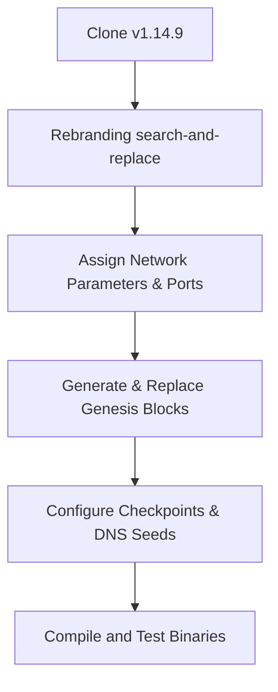

# CommonCoin (COM) Phase 1 — Analysis Report

This report documents the architectural structure of Dogecoin Core `v1.14.9`, our fork strategy, and the dependencies required to successfully compile and deploy CommonCoin.

---

## 1. Architecture Report

### Consensus & Network Parameters
Dogecoin Core inherits its core design from Bitcoin Core but implements several distinctive consensus changes:
* **Mining Algorithm**: Scrypt (sequential memory-hard proof-of-work algorithm).
* **Block Interval**: 1 minute target spacing (`nPowTargetSpacing = 60`).
* **Difficulty Adjustment**: Digishield v3, which retargets difficulty every block to prevent multipool exploitation (`fPowAllowMinDifficultyBlocks = false` on mainnet, `true` on testnet).
* **Subsidy Schedule**: 100,000 coins per block forever, beginning at block 600,000 (blocks 1-600k followed a decaying schedule).
* **Total Supply**: Inflationary, adding ~5.256 billion coins per year.

### RPC Subsystem
* Operates a standard JSON-RPC server.
* Mainnet uses default port `22555` (RPC: `22556`).
* Testnet uses default port `44556` (RPC: `44556`).
* Regtest uses default port `18444` (RPC: `18445`).

### Network & Peer Discovery
* **Seed Nodes**: Dogecoin uses hardcoded DNS seeds (e.g., `seed.dogecoin.com`) and static IP seed listings in `chainparams.cpp` to discover peers when booting up.
* **Message Magic Bytes**: Unique four-byte prefixes prepended to all network messages to drop packets from foreign networks (e.g., Bitcoin or Litecoin).

---

## 2. Dependency Report

To build CommonCoin from source, the environment requires the following software packages:

### System Utilities & Compiler
* **GCC / G++**: Version 8+ or Clang 6+ (supports C++11/C++14).
* **Build Tools**: Autotools (`autoconf`, `automake`, `libtool`), `make`, `pkg-config`.

### Libraries
* **Boost**: C++ utility libraries (specifically `system`, `filesystem`, `thread`, `program_options`, `chrono`, `test`). Version >= 1.58.
* **OpenSSL**: Secure sockets and cryptography providers. Version >= 1.0.2.
* **Libevent**: Event notification library for the network socket interface. Version >= 2.0.
* **Berkeley DB**: Required specifically for the legacy wallet subsystem. Version `4.8.30` is strictly required for binary deterministic wallet portability (newer versions like BDB 5+ create non-portable wallet files).
* **ZeroMQ (Optional)**: Provides message queue support for block/transaction notifications.
* **Qt5 (Optional)**: GUI toolkit for compiling the graphic wallet client (`commoncoin-qt`). Requires `qtbase5-dev`, `qttools5-dev-tools`, and optional SVG utilities.

---

## 3. Fork Strategy

Our fork strategy will proceed by modifying the source files in the following logical steps:

### Key Rebranding Replacements
* Case-sensitive replace of names:
  * `Dogecoin` -> `CommonCoin`
  * `dogecoin` -> `commoncoin`
  * `DOGE` -> `COM`
  * `doge` -> `com`
* Modify binary targets in `configure.ac` and `src/Makefile.am`:
  * `dogecoind` -> `commoncoind`
  * `dogecoin-cli` -> `commoncoin-cli`
  * `dogecoin-tx` -> `commoncoin-tx`
  * `dogecoin-qt` -> `commoncoin-qt`

### Port & Network Allocations
We decouple from Dogecoin by changing network variables:
* Change ports in `src/chainparams.cpp`.
* Change network magic bytes in `src/chainparams.cpp`.
* Reset checkpoints to prevent syncing onto the Dogecoin network.
* Clear default DNS seeds and configure bootstrap nodes.
* Modify address prefix bytes in `src/chainparams.cpp` to map mainnet addresses to `C` (Base58Check prefix `28` / `0x1c`).
